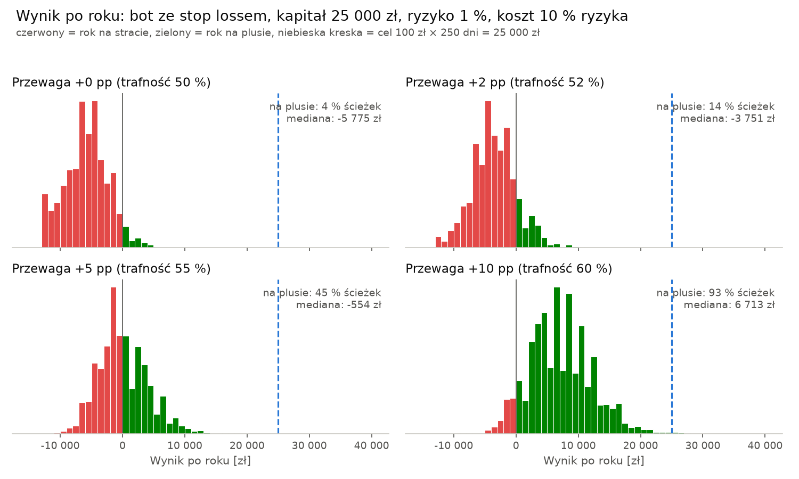
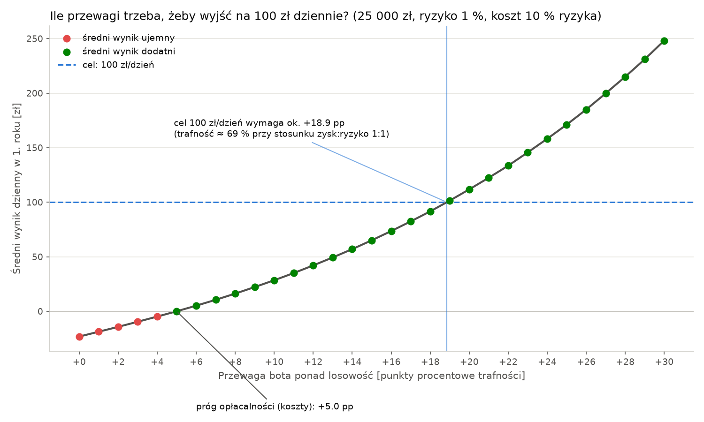
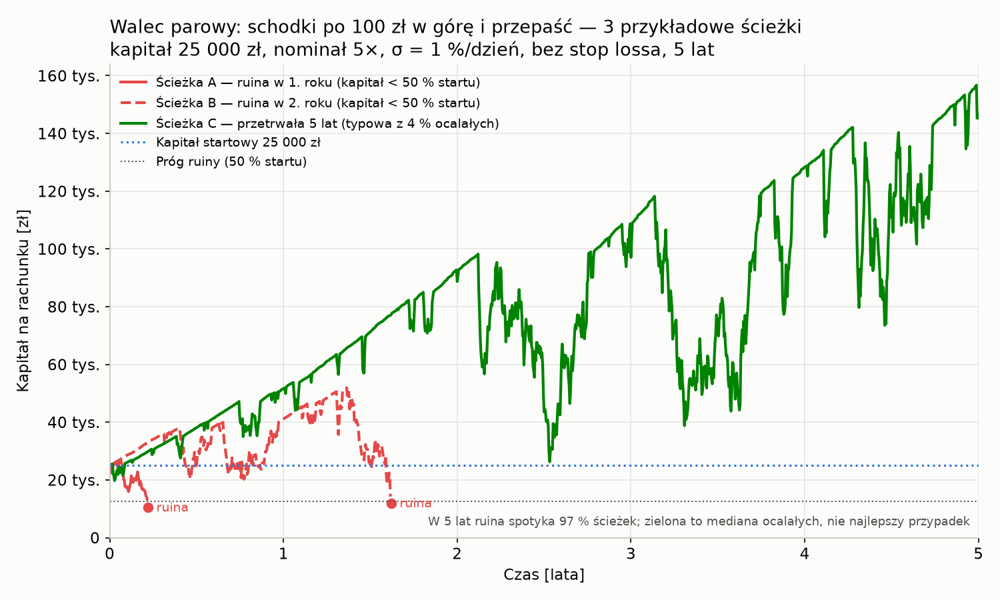
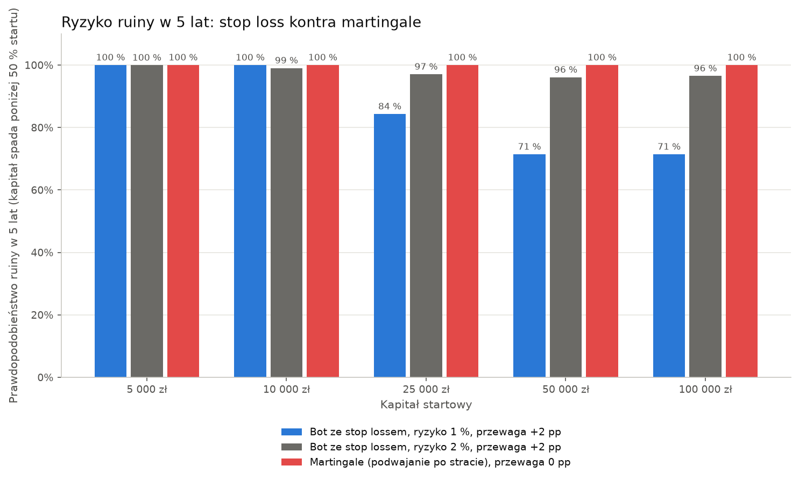

# Bot na XTB „100 zł dziennie” — szanse, kapitał, koszty

Stan na 23–24.09.2026. Pytanie Szefa: automat na XTB, który codziennie zarabia ok. 100 zł i wychodzi z rynku — pełna automatyka, bez pazerności.

Konwencja: **fakt** = liczba ze źródła, **szacunek** = policzone z faktów lub symulacji, **opinia** = moja ocena. Sprzeczności między materiałami nazywam, nie wygładzam.

## 1. Odpowiedź w skrócie

1. Na koncie XTB **pełna automatyka nie jest dziś możliwa oficjalną drogą**: XTB wyłączyło API (interfejs programistyczny do składania zleceń) 14.03.2025 i nie oferuje Expert Advisors ani copy tradingu (Help Center, akt. 17.04.2026). Została nieoficjalna biblioteka jednego autora (0–1 gwiazdka na GitHubie), niepotwierdzona na koncie realnym.
2. Szanse: u XTB **77 % rachunków detalicznych traci** na CFD (2026); w Polsce w 2025 r. **72,2 %** aktywnych klientów forex/CFD skończyło rok ze stratą, a przeciętny *zyskowny* zarobił **7 190 zł rocznie ≈ 29 zł na dzień sesyjny** (KNF). Trwale zyskownych jest **< 1 %** (Tajwan, Barber i in. 2014); z upartych day traderów w Brazylii **97 % straciło** (Chague i in. 2020). Szacunek: trwałe 100 zł dziennie osiąga ułamek procenta próbujących.
3. Kapitał: **bez przewagi nie ma kwoty, która to załatwi** — bot traci tyle, ile płaci brokerowi: 96 % ścieżek kończy rok na minusie, a w 5 lat połowę kapitału traci **97–99 % ścieżek, także konto 100 000 zł** (symulacja A). Z bardzo dobrą, udowodnioną przewagą (+10 punktów procentowych trafności ponad losowość) 100 zł/dzień netto wymaga **ok. 125–220 tys. zł** (100 tys. to dolna granica brutto). Stopami najlepszych na świecie (10–20 %/rok): **125–310 tys. zł**; bez ryzyka (obligacje): **580–820 tys. zł**.
4. Wąskim gardłem nie jest kapitał, tylko **przewaga**: 100 zł z 25 000 zł to 100 % rocznie (z 10 000 zł — 250 %) — więcej niż Berkshire (19,9 %/rok) i fundusze CTA (ok. 4 %/rok).
5. Reguła „biorę 100 zł i wychodzę” nie tworzy zysku; zmienia tylko kształt wyników (dużo małych plusów, rzadkie duże minusy). Bez stop lossa ruina w 5 lat: 71–100 % ścieżek zależnie od dźwigni (97 % przy nominale 5×; model bez luk cenowych, liczba kierunkowa).
6. Alternatywa: te same 25 000 zł rocznie dają obligacje EDO/COI przy 580–650 tys. zł; automat legalnie — półautomat w xStation (bot liczy, człowiek klika) albo broker z API (IBKR, Capital.com, OANDA TMS z MT5).

**Słowniczek:** **CFD** — kontrakt na różnicę kursową: zakład z brokerem o kurs, bez posiadania akcji czy waluty. **Lot** — standardowa wielkość pozycji (DE40: 1 lot = 25 EUR za punkt indeksu). **Spread** — różnica między ceną kupna a sprzedaży, czyli koszt wejścia płacony brokerowi. **Pips / punkt** — najmniejszy krok ceny. **Swap** — opłata za trzymanie pozycji przez noc. **Depozyt / dźwignia** — broker blokuje tylko część nominału (5 % przy 1:20). **Margin call / stop-out** — ostrzeżenie o zbyt małym depozycie i przymusowe zamknięcie pozycji (poniżej 50 % depozytu). **Expert Advisor (EA)** — gotowy bot do MetaTradera. **VPS** — wynajęty serwer, na którym bot chodzi 24/7. **pp** — punkt procentowy. **Backtest / out-of-sample** — test strategii na danych historycznych / na danych nieużytych do strojenia. **Sharpe** — zysk podzielony przez wahania wyniku (im wyżej, tym stabilniej). **R²** — jak dobrze jedna wielkość przewiduje drugą (0 = wcale). **Grid / martingale** — dokładanie lub podwajanie pozycji po stracie.

## 2. Co naprawdę znaczy „100 zł dziennie”

100 zł × 250 dni sesyjnych = **25 000 zł rocznie brutto**; jeśli 100 zł ma być **netto**, po 19 % podatku trzeba **123,46 zł brutto dziennie = 30 864 zł rocznie** (100/0,81). Materiały liczą raz od jednej, raz od drugiej kwoty — podaję obie kolumny.

**Tabela 1. Wymagana roczna stopa a kapitał**

| Stopa/rok | Kapitał na 25 000 zł | Kapitał na 30 864 zł | Kto tyle robi (fakt) |
|---|---:|---:|---|
| 5 % | 500 000 zł | 617 000 zł | obligacje TOS 4,40 %, EDO 5,35 % w 1. roku (gov.pl, IX 2026) |
| 10 % | 250 000 zł | 309 000 zł | S&P 500 z dywidendami 10,69 %/rok 1957–2026 |
| 20 % | 125 000 zł | 154 000 zł | Berkshire 19,9 %/rok 1965–2024 |
| 250 % | 10 000 zł | 12 300 zł | 1 % kapitału dziennie |

Kontekst: Barclay CTA Index (305 profesjonalnych programów) średnio ok. 4,1 %/rok za 2019–2025 (BarclayHedge); systemy automatyczne (Systematic Traders) w 2025 r. **+1,66 %** (The Full FX). Przy 4 %/rok cel wymaga ok. 600 000 zł.

## 3. Dlaczego „biorę 100 zł i wychodzę” nie zmienia matematyki

**Twierdzenie o opcjonalnym stopie po ludzku:** jeśli pojedyncza transakcja ma wartość oczekiwaną zero (moneta), żadna reguła „kiedy przestać” nie zmieni średniej wypłaty — przesuwa tylko, kiedy i w jakich porcjach przychodzą zyski i straty. Przykład: cel +100, po stracie stawka 100→200→400, po 3 stratach koniec dnia: 87,5 % dni kończy się na +100, 12,5 % na −700, średnia **0 zł**. Zysk może pochodzić **wyłącznie** z przewagi w pojedynczej transakcji.

**Koszt spreadu jako % celu.** Runda na 0,1 lota DE40: 9,81 zł przy spreadzie minimalnym 0,9 pkt, **21,6 zł przy średnim rzeczywistym 1,98 pkt** (XTB, II kw. 2026), 38,14 zł w nocy — **10–38 % celu** przy każdej transakcji.

**Wymagana trafność.** Próg opłacalności p\* = (1 + c)/(1 + k), gdzie k = zysk/ryzyko, c = koszt jako % ryzykowanej kwoty. Przy k = 1: c = 0 % → 50 %, 5 % → 52,5 %, 10 % → 55 %, 20 % → 60 %; przy k = 0,5 (mały zysk, szeroki stop) 67–80 %; przy k = 2 33–40 %.

Realne c u XTB dla 0,1 lota DE40: SL 20 pkt (ryzyko 218 zł) → **9,9 % z samego spreadu, ok. 15 % z poślizgiem**; SL 10 pkt → 20–30 %; SL 40 pkt → 5–8 %. Wariant c = 10 % w symulacji jest więc optymistyczny.

**Symulacje Monte Carlo** (losowanie wyniku transakcji z zadaną trafnością; 25 000 zł, 5 000 ścieżek × 250 dni, koszt 10 % ryzyka, ryzyko 1 % kapitału, zysk:ryzyko 1:1).

**Wariant A — stop loss, cel +100, limit dnia −200.** Bez przewagi: 4 % ścieżek na plusie, mediana −5 775 zł/rok. +2 pp: 13 %, −3 751 zł. +5 pp: 44 %, −554 zł (próg). +10 pp (trafność 60 %): 93 %, +6 713 zł = **28 zł/dzień**, nie 100. Na 100 zł/dzień z 25 000 zł trzeba **ok. +19 pp, czyli trafności ≈ 69 %** (przy koszcie 20 %: 74 %).

Zastrzeżenie krytyka, które przyjmuję: przy 25 000 zł i ryzyku 1 % jedna wygrana (+225 zł) przekracza cel, a jedna strata (−275) limit, więc bot robi 1 transakcję dziennie i reguła Szefa jest tu martwa; działa ona jak **hamulec obrotu** — bez przewagi zmniejsza stratę (z −50 zł/dzień bez reguły do −23 zł/dzień z regułą), a przy +10 pp obcina zysk (ze 195 do 28 zł/dzień).

**Wariant B — „walec parowy”: bez stop lossa, trzymam aż pokaże +100.** 93 % transakcji zamyka się z zyskiem tego samego dnia — to jest pułapka. Wynik oczekiwany ujemny we wszystkich 45 kombinacjach; przy 25 000 zł, nominale 5× kapitału i zmienności 1 %/dzień (DAX): −15,4 zł/dzień, mediana roku −12 737 zł, **ruina (utrata połowy kapitału) w rok 62 %, w 5 lat 97 %**; najgorsza pojedyncza strata ~88 % konta. Zakres modelu: nominał 2× → 71–76 %, 20× → 100 %; zmienność 0,5 % przy 2× → 42 %. „Przewaga” 52/48 nic nie zmienia; kapitał nie pomaga, bo pozycja skaluje się do konta (ruina zależy od dźwigni, nie od kapitału). Liczby kierunkowe — model bez luk cenowych.

**Wariant C — martingale (podwajam po stracie).** 86–96 % dni kończy się celem, ale **ruina w rok 99 %, w 5 lat 100 % przy każdym kapitale**; mediana po roku −14 028 zł przy 25 000 zł. Test poprawności: bez kosztów i bez przewagi oba silniki dają ≈ 0 zł/dzień przy każdej regule wyjścia. **Wniosek: reguła wyjścia zmienia kształt rozkładu, nie wartość oczekiwaną.**

## 4. Koszty i instrumenty na XTB

Konto detaliczne XTB S.A. w PLN. Nominały ze Specyfikacji CFD z 27.09.2025 (tabela od 19.09.2026 podaje dla indeksów tylko spread „zmienny”), spready średnie XTB za II kw. 2026; min. wolumen DE40 dla detalu **0,002 lota**. Prowizji nie ma — koszt to spread, swap i 0,5 % marży przy przewalutowaniu wyniku (Tabela opłat, 30.09.2026).

**Tabela 2. Koszt spreadu na 0,1 lota a ruch potrzebny na 100 zł**

| Instrument | 1 lot = | Min. wol. | Spread w zł na 0,1 lota (min. / średni) | Ruch na 100 zł | Udział w celu | Depozyt 0,1 lota |
|---|---|---:|---|---|---|---:|
| DE40 | 25 EUR × indeks | 0,002 | 9,81 (0,9 pkt) / **21,6 (1,98)**; noc 38,14 | 9,2 pkt (0,036 %) | 10–22 %, noc 38 % | ~13 940 zł |
| US100 | 20 USD × indeks | 0,003 | 9,5 (1,25) / 12,1 (1,59) | 13,1 pkt | 10–12 % | ~10 400 zł |
| EURUSD | 100 000 EUR | 0,01 | 3,05 (0,8 pips) / 4,0 (1,06) | 26,2 pips | 3–4 % | ~1 450 zł |
| BITCOIN | 1 BTC | 0,001 | średni spread 205 USD → 78 zł | 263 USD | ~78 % | 50 % nominału |

EURUSD jest najtańszy, ale 26 pipsów to 38 % średniego zakresu dnia; DE40 wymaga 9 pkt przy zakresie dnia 345 pkt — ruch „w zasięgu”, ale w obie strony. Na minimalnym 0,002 lota (0,22 zł/pkt) 100 zł to ~460 pkt, więcej niż przeciętny dzień DAX.

**Swapy** (% nominału na dobę, polska tabela od 21.09.2026; jeden raport cytował starszą z zamienionymi kolumnami long/short): DE40 long −0,017889 % (**≈ −50 zł/dobę na 0,1 lota**), short −0,004333 %; EURUSD long −0,007442 %; BITCOIN −0,09722 %. Bot zamykający pozycje w dniu otwarcia swapów nie płaci; wariant B płaci codziennie — dwa dni swapu to cały cel.

**Kiedy spready się rozszerzają:** DE40 z 1,5 do 3,5 pkt między 00:00 a 8:00 (spec. 2025; obecna tabela podaje tylko „zmienny”), a między 23:00 a 00:00 „obniżona płynność… luki cenowe oraz niestandardowe rozszerzenie spreadu” (spec. PL 19.09.2026, pkt 17); maksima II kw. 2026: DE40 **26,2 pkt**, EURUSD 36 pipsów. XTB jest drugą stroną transakcji i realizuje stopy po cenie rynkowej bez gwarancji (Polityka realizacji zleceń, 30.09.2026). Poślizg w II kw. 2025 (ostatnia publikacja, nie 2022): 44,5 % bez poślizgu, 27,4 % na korzyść, 28,1 % na niekorzyść.

## 5. Ile kapitału naprawdę

Symulacja A (stop loss, ryzyko 1 %, 1:1, koszt 10 % ryzyka — realnie 15 %, więc liczby optymistyczne). Ruina = utrata połowy kapitału.

**Tabela 3. Wynik i ryzyko ruiny zależnie od przewagi i kapitału**

| Scenariusz | Kapitał | P(rok na plusie) | Mediana roku | P(ruina, 1 rok) | P(ruina, 5 lat) | Śr. zł/dzień |
|---|---:|---:|---:|---:|---:|---:|
| Brak przewagi (50 %) | 25 000 zł | 4 % | −5 775 zł | 4 % | **99 %** | −23 |
| Brak przewagi | 100 000 zł | 4 % | −23 099 zł | 0 % | **97 %** | −88 |
| +2 pp (52 %) | 25 000 zł | 13 % | −3 751 zł | 1 % | 84 % | −15 |
| +5 pp (55 %) | 25 000 zł | 44 % | −554 zł | 0 % | 10 % | 0 |
| +10 pp (60 %) | 25 000 zł | 93 % | +6 713 zł | 0 % | 0 % | 28 |
| +10 pp | 100 000 zł | 93 % | **+26 854 zł** | 0 % | 0 % | 113 |

Bez przewagi w 5 lat na plusie jest 0 % ścieżek, a połowę kapitału traci 97–99 % — także konto 100 000 zł. Wrażliwość: przy koszcie 20 % nawet +5 pp daje −23 zł/dzień; każdy punkt kosztu zjada ok. 0,5 pp trafności.

Materiały rozjeżdżają się ok. 30-krotnie (21 tys.–600 tys. zł; 21 000 zł zakłada 214 %/rok, sprzeczne z resztą). Uzgadniam:

- **Brak przewagi:** żadna kwota; większy kapitał = większa strata.
- **Mała przewaga (+2–5 pp):** wynik ≈ 0 minus koszty; 100 zł/dzień nieosiągalne poniżej kilkuset tysięcy.
- **Dobra przewaga (+10 pp, najpierw udowodniona — pkt 10):** **ok. 125–220 tys. zł netto**. 100 000 zł daje średnio 113 zł/dzień (mediana ok. 107 zł/dzień) brutto przy c = 10 %, czyli po 19 % podatku ok. 125 000 zł (100 000/0,81); przy realnym c = 15 % zysk spada mniej więcej o połowę (tabela wrażliwości: 28 → ok. 14 zł/dzień na 25 000 zł), więc ok. 220 000 zł. 100 tys. to dolna granica brutto przy optymistycznym koszcie; zgodne z dolną częścią przedziału „Buffett–S&P” 125–310 tys.
- Depozyt to nie kapitał: 0,1 lota DE40 blokuje ~13 940 zł, do tego bufor na serię strat (10 × 218 zł) i zapas przed margin call (< 100 %) i stop-outem (< 50 %).

**Kapitał „na naukę”** (opinia): osobne **5 000–10 000 zł**, które wolno stracić w całości — wydatek na test, nie inwestycja (średnia strata tracącego klienta CFD w Polsce w 2025 r.: 10 046 zł).

## 6. Dowody — co dzieje się z day traderami i botami

**Tabela 4. Badania i statystyki**

| Źródło | Próba | Wynik |
|---|---|---|
| Chague i in., Brazylia (2019/20) | 19 646 startujących; 1 551 wytrwało > 300 dni | **97 %** wytrwałych straciło; **0,5 % > kasjer (54 USD/dzień)** |
| Barber, Lee, Liu, Odean, Tajwan (2014; 2020) | cała populacja day traderów 1992–2006 | **97 %** prawdopodobnie straci; zyskowny w roku t jest zyskowny w t+1 z prawdopodobieństwem **33 %**; przewidywalnie zyskowni **< 1 %** (2014) / < 3 % (2017) |
| AMF, Francja (2014) | 14 799 klientów CFD/forex 2009–13 | **89,4 %** ze stratą, średnio −10 887 €; stała kohorta 82,5 % → 87,6 % po 4 latach |
| KNF (2026), dane 2025 | 369 737 klientów forex/CFD w PL | **72,2 %** ze stratą (2021–25: 70,6–79,1 %); śr. strata −10 046 zł, śr. zysk zyskownego +7 190 zł (średnia, nie mediana) |
| XTB (2026) | rachunki detaliczne CFD | **77 %** ze stratą; per klasa (II kw. 2025): forex 63,0 %, towary 65,4 %, indeksy 61,7 % — wg notatki sceptyka, bez dokumentu, niezweryfikowane |
| Quantopian, Wiecki i in. (2016) | 888 algorytmów detalicznych ≥ 6 mies. na żywo | backtest **nie przewiduje** wyniku na żywo (R² < 0,025) |

Szacunek: jeden zyskowny rok w Polsce — 27,8 % (fakt, KNF); dwa z rzędu ≈ 9 %, trzy ≈ 3 % (ekstrapolacja tajwańskiego 33 %, luźna analogia); trwale — poniżej 1 %.

**Dlaczego backtesty kłamią.** Bailey i in. (2014): przy 5 latach danych wystarczy **ok. 45 konfiguracji**, by znaleźć fałszywie świetny wynik, a przeuczenie daje **ujemny** wynik poza próbą. Marshall i in. (2008): 7 846 reguł intraday — **żadna** zyskowna po korekcie na wielokrotne testowanie. Mesfin (2026): z 14 rodzin sygnałów intraday 11 zarabia brutto mniej, niż kosztuje spread. Jedyny wyjątek (Gao i in., 2018): 1 transakcja dziennie na SPY, **6,52 % rocznie netto** — z 25 000 zł ~1 600 zł rocznie. Wstępny test z materiałów (57 konfiguracji, ~50 sesji): mediana netto ujemna.

**Boty detaliczne.** MQL5, Myfxbook, Darwinex nie publikują odsetka botów przeżywających rok z zyskiem — nie ustalono; bota z niezależnym audytem nie znaleziono. Znany komercyjny EA „z 8-letnią historią” (grid, dźwignia 1:300 poza UE) ma obsunięcie 72,42 % i zablokowaną subskrypcję; sprzedawca EA martingale: „większość EA martingale w końcu wyzeruje rachunek” (mql5.com, 2026).

**Oszustwa „1 % dziennie”.** CSIRT KNF: w 2025 r. **96,3 %** domen zgłoszonych do blokady (40 225 z 41 751) to fałszywe inwestycje; CBZC: straty **537 mln zł**. 1 % dziennie × 250 sesji = **12× kapitału rocznie** — gdyby działało, fundusze CTA nie zarabiałyby 3–5 %.

## 7. Wykonalność techniczna na XTB

**API.** xAPI wyłączone **14.03.2025** (mail do klientów 19.02.2025; Help Center: „API access is no longer available”; brak Expert Advisors i copy tradingu). MT4 wyłączony 19.04.2024, MT5 nie jest oferowany. Zapowiedzi nowego API: **brak**. Biblioteki open source zarchiwizowane; jedyny bot aktywny w 2026 r. pisze: „cannot run end-to-end”.

**Droga nieoficjalna.** `liskeee/xtb-api-unofficial-ts` (1★, commit 25.03.2026) i `-python` (0★, wydanie 21.04.2026) odtwarzają wewnętrzny protokół xStation 5: logowanie „falls back to Playwright browser if WAF blocks” (XTB blokuje skryptowe logowanie), handel gRPC „not yet accessible”, działa tylko **klikanie w interfejs**. Dwa zgłoszenia bez odpowiedzi, **0 repozytoriów** innych osób, brak testu na koncie realnym.

**Regulamin** (Warunki Ogólne z 13.08.2026): „API” ani zakazu botów wprost nie ma. Ale: pkt 5.3 — klient korzysta z aktualnej Aplikacji XTB lub przeglądarki (własny klient nie jest żadnym z nich); 5.15–5.16 — przy ujawnieniu hasła klient pokrywa straty „bez względu na to, kto faktycznie złożył takie Zlecenie”; 5.22 — zakaz „przetwarzania” danych rynkowych bez zgody; 6.81–6.82 — natychmiastowe rozwiązanie za systematyczne wykorzystywanie „za pomocą oprogramowania” poślizgów cen; 20.21–24 — blokada otwierania pozycji, potem wypowiedzenie z miesięcznym okresem. Przypadków blokady za bota nie znaleziono; czy nieoficjalny klient narusza umowę — **nie ustalono**. Prawo nie zabrania (MiFID II dotyczy firm, nie osób na własny rachunek).

**Utrzymanie i awarie.** VPS 25–70 zł/mies. Dane do backtestu: z XTB świece minutowe tylko za < 1 mies.; Dukascopy bezpłatnie, ale kwotowania ≠ XTB. Udokumentowane problemy: strumień cen „wisi” bez błędu, błędy przy zamykaniu pozycji, w dawnym xAPI `status:true` nie oznaczało przyjęcia zlecenia (podwójne zlecenia), rolowania kontraktów (zlecenia oczekujące mogą wykonać się w luce), tabele zmieniane co kilka tygodni. Gdy bot padnie, pozycja zostaje na serwerze — chronią tylko SL/TP na serwerze i aplikacja mobilna („panic button” od 10.03.2026). Nakład pracy nie-programisty z AI: jedyne studium przypadku to 94 sesje w 3 miesiące i bot nadal na testnecie (dev.to, 2026); szacunek bez źródła: 150–300 godzin.

**Co da się legalnie.** (a) Półautomat w xStation: zlecenia oczekujące z SL/TP, trailing stop **po stronie serwera** („działa nawet po wyłączeniu platformy”), alerty — bot liczy sygnały poza platformą, Szef klika 10–20 min dziennie. (b) Broker z API: Interactive Brokers (Web/TWS API bezpłatne, paper trading; trudne dla nie-programisty), Capital.com (REST + WebSocket, demo; 74 % kont traci), OANDA TMS (KNF; MT5 z gotowymi EA). Te same limity dźwigni KNF; zmiana brokera zmienia, kto klika, nie statystykę 72 %.

## 8. Podatki i formalności

- **19 %** od dochodu z CFD i akcji (art. 30b PIT), roczny **PIT-38** do 30.04.
- XTB wystawia **PIT-8C** (CFD, akcje, ETF w części D); w marcu 2026 ok. 9 % rachunków dostało błędne PIT-8C — sprawdzać.
- Podatek od **rocznego** wyniku netto; CFD i akcje to jedno źródło, także między brokerami; strata do odliczenia przez **5 lat, max 50 % rocznie**; PIT-38 składa się też w roku ze stratą.
- **100 zł netto = 123,46 zł brutto dziennie** (30 864 zł/rok, 5 864 zł podatku). VPS i dane nie są kosztem w PIT-38.
- Działalność gospodarcza: interpretacja KIS z 25.03.2025 — osoba **z CEIDG** handlująca pochodnymi „w sposób zorganizowany i ciągły” ma przychód z działalności. Bez CEIDG w praktyce PIT-38, ale działalność definiują cechy faktyczne (art. 5a pkt 6), a codzienny automat jest „zorganizowany i ciągły” — ryzyko przekwalifikowania (ZUS) **nieocenione**.

## 9. Punkt odniesienia: 100 zł dziennie bez bota

Cel 25 000 zł/rok netto; kapitał = 25 000 / (stopa × 0,81); stopy z września 2026.

**Tabela 5. Ile kapitału na 25 000 zł/rok netto pasywnie**

| Opcja | Brutto/rok | Kapitał | Uwagi (źródło) |
|---|---:|---:|---|
| Wolne środki w XTB (PLN) | 1,40 % (2,80 % przez 90 dni) | 2 200 000 zł | stawka zmieniana co tydzień (xtb.com/pl/odsetki) |
| Obligacje ROR / DOR | 3,75–3,90 % | 790–820 000 zł | za stopą NBP 3,75 % (gov.pl) |
| Lokaty standard | 3,85–4,0 % | 770–800 000 zł | 4,5 % tylko od 500 tys. zł w jednym banku (Moneteo) |
| Obligacje TOS 3-l. | 4,40 % | 700 000 zł | stałe (gov.pl) |
| COI 4-l. / EDO 10-l. | 4,75 % / 5,35 % w 1. roku, potem inflacja + 1,5 / 2,0 pp | 580–650 000 zł | inflacja 3,4 % (GUS) |
| Akcje globalne, reguła 4 % | śr. 7,5–10,7 %, ±40 % w roku | 625 000 zł (bez podatku; z podatkiem ok. 770 000 zł) | reguła 4 % zakłada wypłatę brutto; MSCI World 2008: −40,7 % |
| Obligacje Catalyst | 6,9 % (dane z IV 2026) | 447 000 zł | ryzyko kredytowe, defaulty śr. 3,9 % (Parkiet; obligacje.pl) |

IKE w XTB: limit 2026 **28 260 zł** (bez Belki po 60. r.ż.), IKZE 11 304 zł; 625 tys. zł z samego limitu IKE to ~14–15 lat przy 5–7 %. Plany Inwestycyjne XTB (automatyczny zakup ETF od 50 zł) to jedyna oficjalna „automatyka” w XTB — do kupowania, nie do dziennego zysku. Wniosek: bez ryzyka 100 zł dziennie kosztuje **580–820 tys. zł**; bot z 25 000 zł musiałby być 20–30 razy lepszy od obligacji — trwale.

## 10. Co bym zrobił na miejscu Szefa

**Plan, jeśli mimo wszystko chce spróbować:**

1. **Pytanie do XTB na czacie** (zachować odpowiedź): „Czy mogę składać zlecenia własnym programem łączącym się z xStation 5, nie przez Aplikację/przeglądarkę?”. Bez zgody — nie budować na nieoficjalnym kliencie z hasłem i sekretem 2FA na VPS.
2. **Ścieżka legalna:** półautomat w xStation (bot liczy, człowiek klika, SL/TP i trailing stop na serwerze) albo demo u brokera z API (IBKR, Capital.com, OANDA TMS MT5).
3. **Demo ≥ 3 miesiące** (na błędy techniczne, nie na ocenę zysku), potem **budżet na naukę 5 000–10 000 zł** z góry spisany na straty, mikro-wolumen 0,002–0,01 lota DE40.
4. **Limity w kodzie:** stop loss na serwerze przy każdym otwarciu; ryzyko ≤ 1 % kapitału na transakcję; dzienny limit straty (np. −200 zł); pozycje zamykane przed nocą i przed 23:00; bez handlu przy danych makro i w dni rolowań; watchdog na VPS, aplikacja mobilna jako drugi kanał.
5. **Metryki:** trafność, zysk:ryzyko, obsunięcie, **liczba transakcji**. Odróżnienie trafności 55 % od monety wymaga **~783 transakcji** (test jednej proporcji, α = 0,05, moc 0,80; 194 dla 60 %); Sharpe 1,0 jest istotny po ~3,8 roku — przy 1–2 transakcjach dziennie to **1,5–3 lata testu**.
6. **Kiedy przerwać:** obsunięcie > 30 % budżetu; 3 miesiące z rzędu pod kreską po kosztach; trafność po ≥ 300 transakcjach poniżej (1 + c)/(1 + k) — dla c = 15 % i 1:1 to 57,5 %; strategia działa tylko po „dostrojeniu” do historii.
7. **Skalować dopiero po ≥ 500 transakcjach na realu** z plusem po kosztach — zysk skaluje się z kapitałem (28 zł/dzień z 25 000 zł przy +10 pp), nie z celem.

**Czego nie robić:** martingale/grid (ruina 100 % w 5 lat); handlu bez stop lossa (ruina w 5 lat 71–100 % zależnie od dźwigni, 97 % przy nominale 5× — liczba kierunkowa; jedna pozycja zabiera 50–90 % konta); celu dziennego jako przymusu; botów „AI”, „1 % dziennie”; backtestu bez próby out-of-sample i kosztów XTB (spread 1,98 pkt, nie 0,9); hasła i TOTP na jednym serwerze; handlu w nocy i w dni rolowań.

**Wariant „bez bota”:** jeśli celem jest 100 zł dziennie, a nie sam automat — obligacje EDO/COI plus IKE w XTB z ETF-ami globalnymi do limitu 28 260 zł rocznie; cel przy ok. 580–650 tys. zł, bez ryzyka wyzerowania i nadzoru. Jeśli automat ciągnie jako projekt inżynierski — robić go na demo, jak naukę statystyki; jako źródło dochodu kończy się stratą dla ok. 72 % w skali roku (KNF) i dla > 97 % tych, którzy próbują latami (Brazylia, Tajwan).

## 11. Źródła

XTB, regulacje, koszty:
- https://www.xtb.com/int/help-center/our-platforms-6-4/does-xtb-offer-investment-automation-tools-4
- https://github.com/pawelkn/xapi-python/issues/12
- https://xopenhub.pro/api/xapi-protocol-documentation/
- https://github.com/liskeee/xtb-api-unofficial-ts
- https://github.com/liskeee/xtb-api-unofficial-python
- https://www.xtb.com/pl/pliki/01.-gtc_clean-13-08-2026.pdf
- https://www.xtb.com/pl
- https://xtb.scdn5.secure.raxcdn.com/file/0102/43/17cf4db5-be33-4f9a-9f33-933939784df7/specyfikacja-instrumentow-cfd-forex-indexy-towary-kryptowaluty-27-09-2025.pdf
- https://xas-new-cdn.xtb.com/file/0104/80/eda2b0c2-49a0-4bb8-91e6-331398a3b74e/otc-tabela-specyfikacji-pl-1-1.pdf
- https://www.xtb.com/pl/pliki/informacja-o-s-redniej-i-maksymalnej-wartos-ci-spreado-w-q226-1-.pdf
- https://xas-new-cdn.xtb.com/file/0090/17/adaffc1c-7f10-4a76-8f2e-0b8178491eb5/swaps-pl.pdf
- https://xas-new-cdn.xtb.com/file/0104/79/eaaf8c48-e03c-418a-ae48-9bf1b5e428a4/02-tabela-oplat-i-prowizji-pl-clean-1.pdf
- https://xas-new-cdn.xtb.com/file/0104/79/27320ee3-9538-45fd-a785-a495e7a5eaba/05-polityka-realizacji-zlecen-cfd-clean-30092026.pdf
- https://xtb.scdn5.secure.raxcdn.com/file/0104/16/fe168d3a-a278-47f1-a044-422d85b9310a/pl-inf-o-standardowym-czasie-wykonania-2q2025-2.pdf
- https://www.xtb.com/pl/odsetki
- https://www.xtb.com/pl/edukacja/stop-loss-take-profit-stop-loss-kroczacy
- https://www.knf.gov.pl/knf/pl/komponenty/img/Wyniki_Forex_%202025%20_97618.pdf
- https://dziennikurzedowy.knf.gov.pl/DU_KNF/2019/27/akt.pdf

Podatki:
- https://www.podatki.gov.pl/media/g5ebnm2e/broszura-do-pit-38-za-2025-r.pdf
- https://www.xtb.com/pl/edukacja/jak-rozliczyc-podatek-inwestycje-xtb
- https://subiektywnieofinansach.pl/xtb-pit-8c-jak-rozliczyc-podatek/
- https://www.inforlex.pl/dok/tresc,FOB0000000000006902370,Interpretacja-indywidualna-z-dnia-25-marca-2025-r-Dyrektor-Krajowej-Informacji-Skarbowej-sygn-0112-KDIL2-2-4011-189-2025-1-MC.html

Badania, statystyki, oszustwa:
- https://papers.ssrn.com/sol3/papers.cfm?abstract_id=3423101
- https://faculty.haas.berkeley.edu/odean/papers/day%20traders/The%20Cross-Section%20of%20Speculator%20Skill.pdf
- https://faculty.haas.berkeley.edu/odean/papers/Day%20Traders/Day%20Trading%20and%20Learning%20110217.pdf
- https://academic.oup.com/raps/article/10/1/61/5658397
- https://www.amf-france.org/sites/institutionnel/files/contenu_simple/rapport_etude_analyse/epargne_prestataire/Etude%20des%20resultats%20des%20investisseurs%20particuliers%20sur%20le%20trading%20de%20CFD%20et%20de%20Forex%20en%20France.pdf
- https://papers.ssrn.com/sol3/papers.cfm?abstract_id=2326253
- https://quantpedia.com/quantopians-academic-paper-about-in-vs-out-of-sample-performance-of-trading-alg/
- https://econpapers.repec.org/RePEc:eee:empfin:v:15:y:2008:i:2:p:199-210
- https://arxiv.org/abs/2605.04004
- https://papers.ssrn.com/sol3/papers.cfm?abstract_id=2440866
- http://alumni.media.mit.edu/~panwei/pub/socialcom12.pdf
- https://portal.barclayhedge.com/cgi-bin/indices/displayCtaIndex.cgi?indexCat=Barclay-CTA-Indices&indexName=Barclay-CTA-Index
- https://thefullfx.com/ctas-end-2025-on-a-positive-note/
- https://www.berkshirehathaway.com/letters/2024ltr.pdf
- https://www.officialdata.org/us/stocks/s-p-500
- https://www.mql5.com/en/signals/995287
- https://cebrf.knf.gov.pl/images/Raporty/Raport_Roczny_CSIRT_KNF_97516.pdf
- https://cbzc.policja.gov.pl/download/442/2947/WynikistatystyczneCentralnegoBiuraZwalczaniaCyberprzestepczosciza2025rok.pdf

Praktyka, alternatywy, punkt odniesienia:
- https://dev.to/cart0ne/i-used-claude-code-to-build-a-crypto-trading-bot-94-sessions-later-heres-what-works-1i2j
- https://www.interactivebrokers.com/campus/ibkr-api-page/web-api-trading/
- https://open-api.capital.com/
- https://www.tms.pl/oferta/metatrader5
- https://www.gov.pl/web/finanse/oferta-oszczednosciowych-obligacji-skarbowych--wrzesien-2026-r
- https://moneteo.com/rankingi/lokaty-bankowe
- https://www.parkiet.com/obligacje/art44105941-duzy-wybor-krotkoterminowych-obligacji-na-rynku-catalyst
- https://www.gov.pl/web/rodzina/ike-limit-wplat

Symulacje (pliki w katalogu `symulacja/` obok tego raportu): `sim_bot100.py`, `tables_full.md`, `results.json` (warianty A i C); `sim_wariant_b.py`, `wyniki_wariant_b.md`, `wyniki_wariant_b.json` (wariant B).
